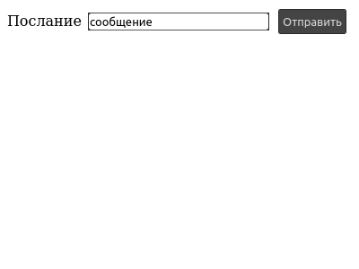
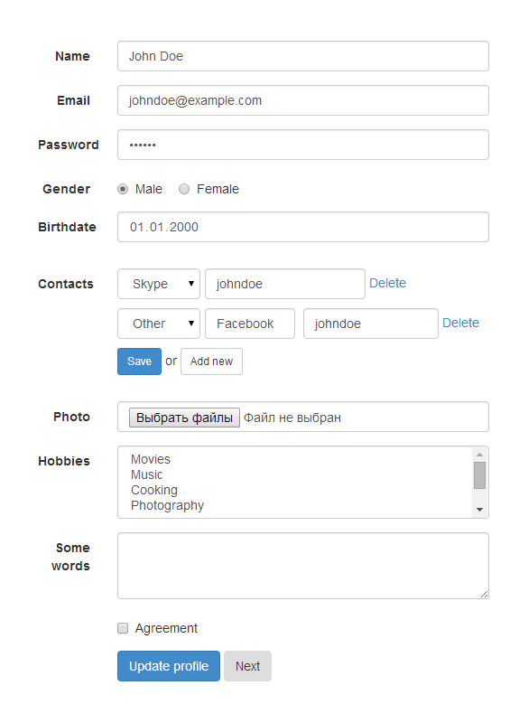
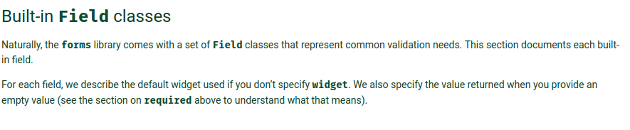
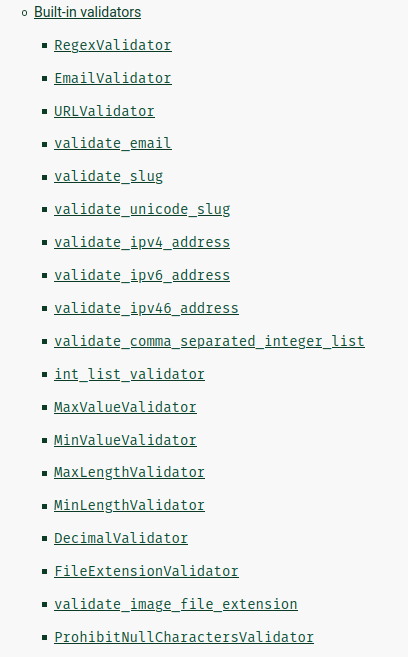
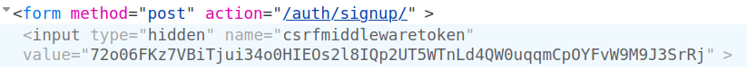
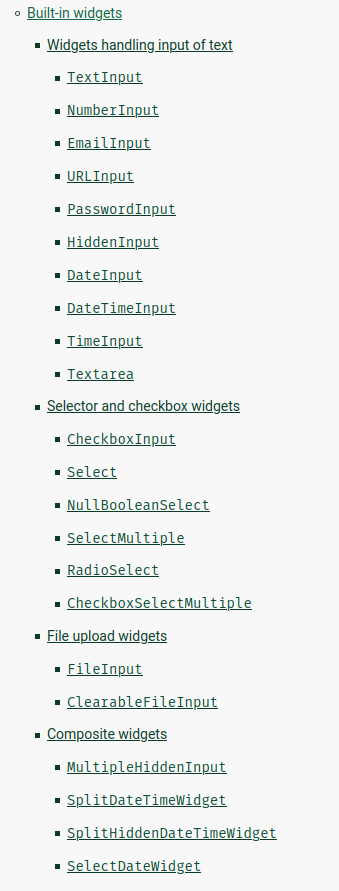

- [HTML](#orgae4cd2e)
- [Django templates](#org3dcbb84)
- [наследование](#orgcd3c19a)
- [передача переменных](#org867ac54)
- [Дополнительная литература](#org655f5e8)
- [HTML формы](#org4dc7d00)
- [HTML формы](#org4aba72c)
- [HTML формы](#org9195320)
- [Django формы](#orgc559a42)
- [Django формы](#org05ee131)
- [Django формы](#org302fa98)
  - [<span class="underline">[Form Fields](https://docs.djangoproject.com/en/3.2/ref/forms/fields/#built-in-field-classes)</span>](#org9c11e0e)
- [Bound / Unbond forms](#org49c49cb)
- [Unbound](#org14465c5)
- [Bound](#orgc98c95e)
- [Валидация форм](#org308c3c0)
- [Валидаторы](#org0e3e49f)
- [Валидаторы](#org4a6c67c)
- [Валидаторы](#orgcd60a4c)
- [Forms Workflow](#orgd7589de)
- [Рендеринг форм вручную](#org4967799)
- [Безопасность](#orgc4594a1)
- [CSRF](#org473c328)
- [CSRF](#org0420332)
- [CSRF](#org36e5c6e)
- [ModelForm](#orgad4cb99)
- [ModelForm](#orgc61542b)
- [ModelForm](#org339e09e)
  - [save(commit=False)](#org61a585b)
- [ModelForm](#org48d3243)
- [ModelForm](#org165d60c)
- [ModelForm](#org4f64408)
- [ModelForm](#orgd271942)
- [ModelForm](#orgf35deb0)
- [Widgets](#org38364ac)
- [Widgets](#orge18c9b7)
- [Widgets](#orgc76767a)
- [Widgets](#org10eac6b)
- [Немного практики](#org4b907f0)
- [Вопросы-ответы](#org8c7aa6b)


<a id="orgae4cd2e"></a>

# HTML

```html
<html>
  <head>
    <title>Мир! Труд! Май!</title>
  </head>
  <body>
    <center
      onclick="alert('привет!')"
      style="color:red;font-size:40px"
    >
      <!-- тут нужно вставить своё имя -->
      <i>Привет, &lt;ИМЯ&gt;!</i>
    </center>
  </body>
</html>
```


<a id="org3dcbb84"></a>

# Django templates

```html
<html>
  <head>
    <title>Мир! Труд! Май!</title>
  </head>
  <body>
    <center
      onclick="alert('привет!')"
      style="color:red;font-size:40px"
      >
      <i>Привет, {{ name }}!</i>
    </center>
  </body>
</html>
```


<a id="orgcd3c19a"></a>

# наследование

-   **extends:** взять за основу *расширяемый шаблон* и *переопределить* в нём нужные блоки. Остальное содержимое шаблона останется прежним.
-   **include:** вставить на место **** содержимое подключаемого шаблона.


<a id="org867ac54"></a>

# передача переменных

-   В шаблоне доступны объекты из middleware, например [user](https://docs.djangoproject.com/en/4.0/topics/auth/default/#authentication-data-in-templates)
-   Нужные вам переменные вы передаёте из вьюхи во [время рендеринга](https://docs.djangoproject.com/en/4.0/topics/http/shortcuts/#render)


<a id="org655f5e8"></a>

# Дополнительная литература

-   <https://docs.djangoproject.com/en/2.2/ref/templates/builtins/>
-   <https://docs.djangoproject.com/en/2.2/topics/templates/>
-   <https://habr.com/ru/post/23132/?ysclid=l2hw076rbl>


<a id="org4dc7d00"></a>

# HTML формы

[**HTML-формы**](https://developer.mozilla.org/en-US/docs/Web/HTML/Element/form) это просто текст. И вообщем-то мы можем писать его вручную или, например, с использованием f-string в Python.  

```html
<form action="." method="post">
 <label for="message">Послание</label>
 <input type='text' name="message"
        value="сообщение"
        maxlength="100" />
 <input type="submit"
       value="Отправить" />
</form>
```

  


<a id="org4aba72c"></a>

# HTML формы

Формы могут быть более красивыми  

  


<a id="org9195320"></a>

# HTML формы

И очень разнообразными. Но писать такие разнообразные формы вручную это очень утомительно. На помощь нам приходят [**Django Forms**](https://docs.djangoproject.com/en/3.2/topics/forms/).  

  


<a id="orgc559a42"></a>

# Django формы

```python
from django import forms

class MessageForm(forms.Form):
    message = forms.CharField(
        label='Послание',
        max_length=100
    )

form = MessageForm(
    initial={'message': 'сообщение'}
)
```

*initial* заполнит форму какими-то данными. При рендеринге это будет значение атрибута *value* в HTML. Обычно мы передаём туда *request.POST*  


<a id="org05ee131"></a>

# Django формы

```html
<tr>
  <th>
    <label for="id_message">
      Послание:
    </label>
  </th>
  <td>
    <input type="text"
           name="message"
           value="сообщение"
           maxlength="100"
           required
           id="id_message" />
  </td>
</tr>
```


<a id="org302fa98"></a>

# Django формы


<a id="org9c11e0e"></a>

## <span class="underline">[Form Fields](https://docs.djangoproject.com/en/3.2/ref/forms/fields/#built-in-field-classes)</span>

Поля формы в Django описываются классами Field, каждый из которых имеет своё представление в виде Widget-а.  
  


<a id="org49c49cb"></a>

# Bound / Unbond forms

Формы в *Django* **[могут быть в двух состояних](https://docs.djangoproject.com/en/3.2/ref/forms/api/#bound-and-unbound-forms)**  

-   **unbound:** — форма пустая
-   **bound:** — форма заполнена данными


<a id="org14465c5"></a>

# Unbound

Форма не связана ни с какими данными  

```python
form = MessageForm()
form.is_bound   # -> False
```


<a id="orgc98c95e"></a>

# Bound

Форма *частично* или *полностью* заполнена  

```python
# обычно мы передаём request.POST
form = MessageForm({
    'message': 'foobar'
})
form.is_bound   # -> True
```


<a id="org308c3c0"></a>

# Валидация форм

[**Документация**](https://docs.djangoproject.com/en/3.2/ref/forms/validation/)  

```python
form.is_valid()  # -> True / False
# в случае когда is_valid -> True,
# тогда у формы появляется атрибут
# cleaned_data, который содержит
# словарь со значениями полей
form.cleaned_data['field_name']
# если is_valid -> False
# то заполняется переменная
form.errors
```


<a id="org0e3e49f"></a>

# Валидаторы

Пример написания своего валидатора  

```python
from django.core.exceptions import (
    ValidationError
)

def validate_even(value):
    if value % 2 != 0:
        raise Validationerror(
            '%(value) нечётно',
            params={'value': value}
        )
```


<a id="org4a6c67c"></a>

# Валидаторы

```python
from django import forms

class EvenNumbersForm(forms.Form):
    number = forms.IntegerField(
        validators=[validate_even]
    )
```

*validators* добавит валидаторы к уже существующему базовому валидатору *IntegerField*  


<a id="orgcd60a4c"></a>

# Валидаторы

[**Готовых валидаторов очень много!**](https://docs.djangoproject.com/en/3.2/ref/validators/)  

  


<a id="orgd7589de"></a>

# Forms Workflow

  


<a id="org4967799"></a>

# Рендеринг форм вручную

-   <span class="underline"><span class="underline">[Статья](https://www.geeksforgeeks.org/render-django-form-fields-manually/)</span></span>
-   <span class="underline"><span class="underline">[оф. документация](https://docs.djangoproject.com/en/4.0/topics/forms/#rendering-fields-manually)</span></span>

```html
{{ form.non_field_errors }}
<div class="fieldWrapper">
    {{ form.subject.errors }}
    <label
     for="{{form.subject.id_for_label}}" />
    >
      Email subject:
    </label>
    {{ form.subject }}
</div>
```


<a id="orgc4594a1"></a>

# Безопасность

[**Настоятельно рекомендую ознакомиться с этой документацией**](https://docs.djangoproject.com/en/3.2/topics/security/)  
\newline  
<https://docs.djangoproject.com/en/3.2/topics/security/>  


<a id="org473c328"></a>

# CSRF

На сайте может быть обычная кнопка, предлагающая вам посмотреть фотографии.  

  


<a id="org0420332"></a>

# CSRF

А на самом деле там будет отправляться форма перевода денег с вашего аккаунта на аккаунт злоумышленника.  

```html
<form
  action="bank.com/transfer.do"
  method="POST">
  <input type="hidden"
         name="acct" value="воришка"/>
  <input type="hidden"
         name="amount" value="$1kk"/>
  <input type="submit"
         value="View my pictures!"/>
</form>
```


<a id="org36e5c6e"></a>

# CSRF

Но если на стороне банка используются csrf-токены в формах, то ничего страшного не случится. Запрос злоумышленника не может содержать нужное значение (случайное в рамках сессии) csrf-токена.  

```html
<form method="post"
      action="">
  
</form>
```

  


<a id="orgad4cb99"></a>

# ModelForm

[**Прекрасная документация**](https://docs.djangoproject.com/en/3.2/topics/forms/modelforms/)  


<a id="orgc61542b"></a>

# ModelForm

У ModelForm появляется метод **.save()**  

```python
class NameForm(models.ModelForm):
    class Meta:
        model = Name

form = NameForm(request.POST)
# сохранить запись в базу данных
form.save()
```


<a id="org339e09e"></a>

# ModelForm


<a id="org61a585b"></a>

## save(commit=False)

```python
class NameForm(models.ModelForm):
    class Meta:
        model = Name

form = NameForm(request.POST)
# создаёт объект модели Name
# но не записываем его в базу
model = form.save(commit=False)
```


<a id="org48d3243"></a>

# ModelForm

```python
class YaForm(models.ModelForm):
    class Meta:
        # содержит поля X, Y, Z
        model = YaModel
        fields = ['X', 'Y']

form = YaForm(request.POST)
# не передаст в модель Z,
# а значит в базу запишется
# пустое значение поля Z
from.save()
```


<a id="org165d60c"></a>

# ModelForm

Один из вариантов решения — определить модель заранее  

```python
model = YaModel(Z='foobar')
form = YaForm(
    request.POST,
    instance=model
)
# форма будет содержать все
# поля заполненными
form.save()
```


<a id="org4f64408"></a>

# ModelForm

Или использовать *commit=False* чтобы доопределить модель перед записью в БД.  

```python
form = YaForm(request.POST)
model = form.save(commit=False)
model.Z = 'foobar'
model.save()
```


<a id="orgd271942"></a>

# ModelForm

Допустим, мы определили модель  

```python
class Article(models.Model):
  headline = models.CharField(
    max_length=200,
    null=True,
    blank=True,
  )
  content = models.TextField()
```


<a id="orgf35deb0"></a>

# ModelForm

Если поле не перечислено в *fields* или добавлено в *excludes* в Meta-классе, то это поле будет исключено из данных передаваемых в модель.  

```python
class ArticleForm(ModelForm):
  slug = CharField(
    validators=[validate_slug]
  )

  class Meta:
    model = Article
    # slug не попадёт в save()
    fields = ['headline', 'content']
```


<a id="org38364ac"></a>

# Widgets

Виджеты это то как формы будут представлены на web-страницы, то есть виджеты отвечают за генерацию HTML-кода для полей форм.  
**[Документация](https://docs.djangoproject.com/en/3.2/ref/forms/widgets/)**  

  


<a id="orge18c9b7"></a>

# Widgets

Можно добавлять стили и другие атрибуты виджетам  

```python
class CommentForm(forms.Form):
  name = forms.CharField(
    widget=forms.TextInput(
      attrs={'class': 'special'}
    )
  )
  url = forms.URLField()
  comment = forms.CharField(
    widget=forms.TextInput(
      attrs={'size': '40'}
    )
  )
```


<a id="orgc76767a"></a>

# Widgets

```python
class CommentForm(ModelForm):
  class Meta:
    model = Comment
    fields = (
      'name', 'url', 'comment'
    )
    widgets = {
      'name': forms.TextInput(
        attrs={'class': 'special', 'rows': 20}
      ),
      'comment': forms.TextInput(
        attrs={'size': '40'}
      )
    }
```


<a id="org10eac6b"></a>

# Widgets

```html
<input type="text" name="name"
       class="special" required>

<input type="url" name="url"
       required>

<input type="text" name="comment"
       size="40" required>
```


<a id="org4b907f0"></a>

# Немного практики

-   <span class="underline"><span class="underline">[Примеры](https://docs.djangoproject.com/en/2.2/ref/forms/widgets/)</span></span>
-   <span class="underline"><span class="underline">[Ещё примеры](https://www.javatpoint.com/django-form-widget)</span></span>
-   <span class="underline"><span class="underline">[django-colorfield](https://pypi.org/project/django-colorfield/)</span></span>


<a id="org8c7aa6b"></a>

# Вопросы-ответы


